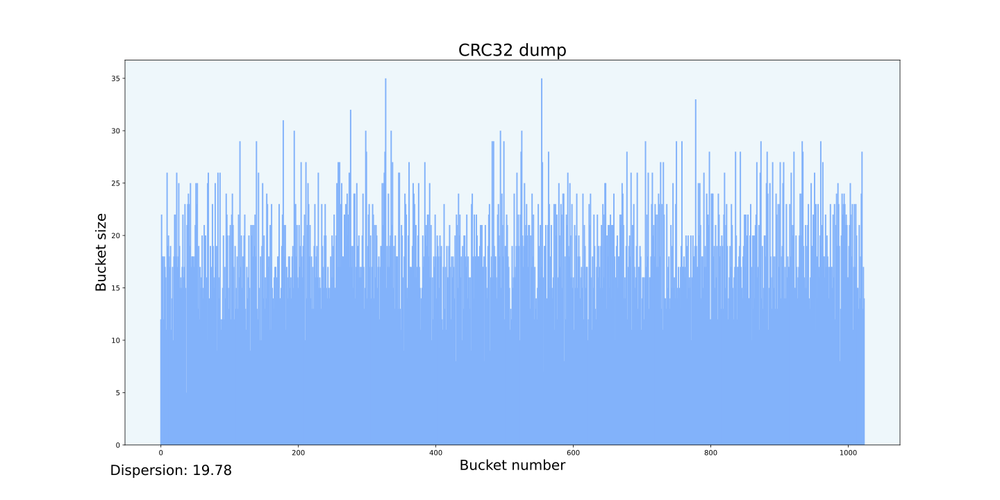

# Hash Table

---

## Оглавление

- [Введение](#введение)
- [Цель и задачи](#цель-и-задачи)
- [Выбор хэш-функции](#выбор-хэш-функции)
- [Методика измерений](#методика-измерений)
- [Базовая версия](#базовая-версия)
- [Версия с оптимизациями компилятора](#версия-с-оптимизациями-компилятора)
- [Оптимизация strcmp](#оптимизация-strcmp)
- [Анализ результатов](#анализ-результатов)
- [Вывод](#вывод)

---

## Введение

Хэш-таблица (**_Hash Table_**) — это структура данных, позволяющая хранить элементы в представлении ключ-значения. Хэш-таблица использует хэш-функцию для вычисления числа (**_хэш_**/**_hash_**) по ключу, которое указывает в какой слот (**_bucket_**) попадет ключ со своими значениями.

Бывают случаи, когда хэш-функция выдает один и тот же хэш для разных ключей - это называется **_коллизией_**. В результате коллизии в одном слоте (bucket-е) находится множество различных элементов, что затрудняет поиск правильного значения по ключу. Как можно разрешить проблему коллизии?

1. **Метод списков** (цепочек) - используется в работе

Каждый слот массива - указатель на связный список пар ключ-значения, для которых хеш-функция выдала один результат. Коллизии приводят к тому, что появляются списки длиной более одного элемента. Чтобы избежать коллизий в данной работе используется линейный поиск элементов внутри списка (bucket-а).

<figure style="text-align: center;">
    
    <figcaption>Метод списков</figcaption>
</figure>

2. **Открытая адресация**

Элементы хэш-таблицы хранятся в общем массиве. Если происходит коллизия, то ищется свободная ячейка по определенной схеме (**_метод пробирования_**/**_probing_**) в зависимости от реализации: линейное, квадратичное пробирование или двойное хэширование.

<figure style="text-align: center;">
    
    <figcaption>Открытая адресация</figcaption>
</figure>

Одним из ключевых параметров оценки эффективности хэш-таблицы является фактор/коэффициент загрузки (**_load factor_**):

$$Load \space factor = \frac{Количество \space объектов \space в \space таблице \space (N)}{Размер \space таблицы \space (n)}$$

> [!NOTE]
> Для получения корректного результата при работе хэш-таблицы со строковыми данными следует помнить, что N - количество **уникальных** входных слов, n - общий размер массива (в случае метода списков - количество самих списков, bucket-ов)

> [!IMPORTANT]
> На практике для достижения наибольшей производительности и минимизации коллизий в хэш-таблице оптимальным диапазоном значений для фактора загрузки является:
>
> 1. Для открытой адресации: `Load factor < 1` (_"В любой момент размер таблицы должен быть больше или равен общему количеству ключей"_ - [Geeksforgeeks.org](https://www.geeksforgeeks.org/open-addressing-collision-handling-technique-in-hashing/)).
> 2. Для метода списков: `1 < Load factor < 3` (источник - [Wikipedia/HashTable](https://en.wikipedia.org/wiki/Hash_table))

> [!WARNING]
> В учебных целях фактор загрузки в данной работе был **увеличен** специально для получения частых ситуаций коллизий, которые замедляют поиск. Это позволило лучше отслеживать скорость выполнения алгоритма поиска элементов в хэш-таблице на каждом этапе его оптимизации.

В качестве входных данных для хэш-таблицы было выбрано произведение _J.R.R Tolkien "The Lord of the Ring 1 - The Fellowship of the Ring"_ в оригинале. После обработки во входном файле оказалось `531307` слов, из которых `19030` являются уникальными. Изначальный размер хэш-таблицы - `1024`, обоснование подобного выбора размера будет приведено _далее_ в работе. $Load \space factor \approx 19$.

<p align="right"><a href=#оглавление>(к оглавлению)</a></p>

---

## Цель и задачи

**_Цель_** - провести оптимизацию алгоритма поиска элементов в собственной реализации хэш-таблицы с использованием различных ассемблерных оптимизаций и инструментов для оценки производительности программы.

**_Задачи_**:

1. Выбрать хэш-функцию для таблицы
2. Написать реализацию хэш-таблицы
3. Выбрать инструмент оценки производительности программы
4. Провести оптимизации наиболее _горячих_ функций поиска
5. Проанализировать результаты оптимизаций

<p align="right"><a href=#оглавление>(к оглавлению)</a></p>

---

## Выбор хэш-функции

Проведем анализ некоторых хэш-функций с помощью скрипта, написанного на языке _python_, позволяющего наглядно увидеть распределение данных для определенной хэш-функции на _гистограмме_ и рассчитывающий _дисперсию_ значений заполненности bucket-ов в таблице. Наилучшей функцией будем считать ту, распределение данных по которой наиболее случайно на гистограмме и дисперсия минимальна.

<figure style="text-align: center;">
    
</figure>

<figure style="text-align: center;">
    
</figure>

<figure style="text-align: center;">
    
</figure>

<figure style="text-align: center;">
    
</figure>

Можно сделать вывод, что среди рассмотренных хэш-функций наиболее случайное распределение имеют `MurMur1 hash` и `CRC32 hash`, но последняя все же имеет наименьшую дисперсию. Именно **_CRC32 hash_** выбрана для хэш-таблицы.

<p align="right"><a href=#оглавление>(к оглавлению)</a></p>

---

## Методика измерений

1.  **Характеристики аппаратуры**

    - Операционная система: Linux 6.11.0-21-generic (x86_64)
    - Процессор: 12th Gen Intel(R) Core(TM) i5-12600KF; 10 cores; 16 treads
    - Компилятор: GCC (Ubuntu 13.3.0-6ubuntu2~24.04) 13.3.0

2.  **Инструменты оценки производительности**

    - **_Perf_** — инструмент для анализа производительности в Linux, встроенный в ядро. Он позволяет собирать данные о циклах процессора, промахах кэша (**_cache-misses_**), системных вызовах, промахах ветвлений (**_branch-misses_**), сменах контекста (**_context switches_**) и об _"узких местах"_ в программе. Основан на **_PMU (Performance Monitoring Unit)_** процессора. Источник - [Brendan Greg](https://www.brendangregg.com/perf.html). Графическую информацию можно получить с помощью **_flame graphs_** или графической оболочки **Hotspot**.

    ```
    perf record -F 99 -g ./build/Release/HashTable --crc32
    hotspot perf.data
    ```

    - **_Valgrind_** — набор инструментов для отладки, анализа утечек памяти, поиска ошибок управления памятью и профилирования программ, работающих под Linux. Включает в себя различные модули, например **_Cachegrind_** - анализ использования кэша процессора (L1/L2) и **_Callgrind_** - профилирование вызовов функций. Для визуализации используется графическая оболочка **_kcachegrind_**.

    ```
    valgrind --tool=callgrind ./build/Release/HashTable --crc32
    kcachegrind callgrind.out.base
    ```

> [!TIP]
> Для проверки корректности работы соответствующих оптимизаций будем сравнивать результаты обоих инструментов между собой и с предыдущими версиями без оптимизаций.

> [!NOTE]
> Поиск будет производиться по элементам из того же файла, откуда элементы загрузились в хэш-таблицу и количество таких файлов поиска составляет константа `FINDER_ITERATIONS` = 700, то есть всего будет произведено `371914900` операций поиска слов.

> [!IMPORTANT]
> Измерения времени будем проводить только для функции поиска элементов по хэш-таблице, убедившись, что поиск занимает большую часть времени выполнения программы по сравнению с загрузкой элементов в таблицу. Кроме того, не забудем внести под условную компиляцию проверки и верификаторы списков.

<p align="right"><a href=#оглавление>(к оглавлению)</a></p>

---

## Базовая версия

1. **С оптимизацией `-O3`:**
   | № | 1 | 2 | 3 | 4 | 5 | 6 | 7 | 8 | 9 | 10 |
   | :--: | :---: | :---: | :---: | :---: | :---: | :---: | :---: | :---: | :---: | :---: |
   | t, c | 18,80 | 18,74 | 18,80 | 18,80 | 18,72 | 18,81 | 18,75 | 18,80 | 18,82 | 18,73 |

   **Статистика**

   - Среднее время: `18,77 ± 0,33` с (`1,8` %)
   - FPS: `16,86 ± 0,16` (`0,96` %)

2. **Без оптимизации:**
   | № | 1 | 2 | 3 | 4 | 5 | 6 | 7 | 8 | 9 | 10 |
   | :--: | :---: | :---: | :---: | :---: | :---: | :---: | :---: | :---: | :---: | :---: |
   | t, c | 39,79 | 39,78 | 39,88 | 39,74 | 40,02 | 39,87 | 39,58 | 39,58 | 39,59 | 39,64 |

   **Статистика**

   - Среднее время: `39,75 ± 0,71` с (`1,8` %)
   - FPS: `8,46 ± 0,02` (`0,27` %)

<p align="right"><a href=#оглавление>(к оглавлению)</a></p>

---

## Версия с оптимизациями компилятора

<p align="right"><a href=#оглавление>(к оглавлению)</a></p>

---

## Оптимизация strcmp

<p align="right"><a href=#оглавление>(к оглавлению)</a></p>

---

## Анализ результатов

<p align="right"><a href=#оглавление>(к оглавлению)</a></p>

---

## Вывод
