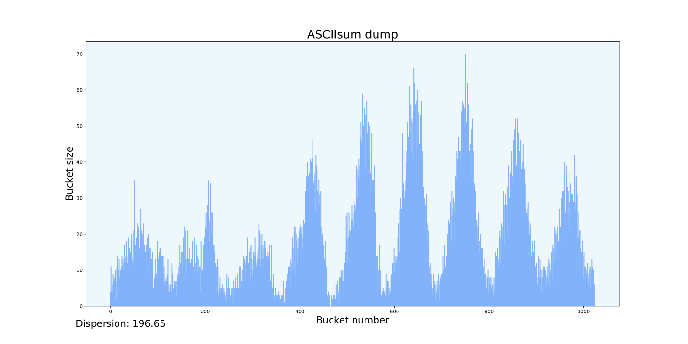
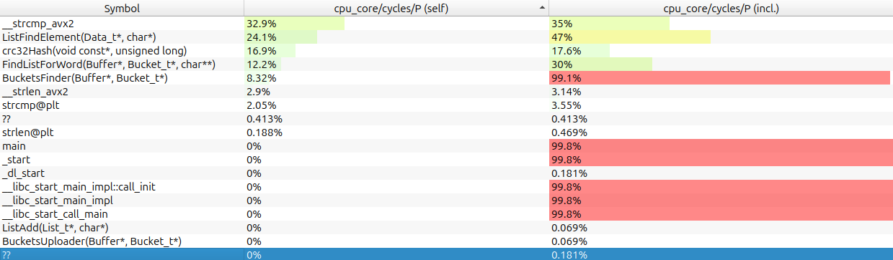
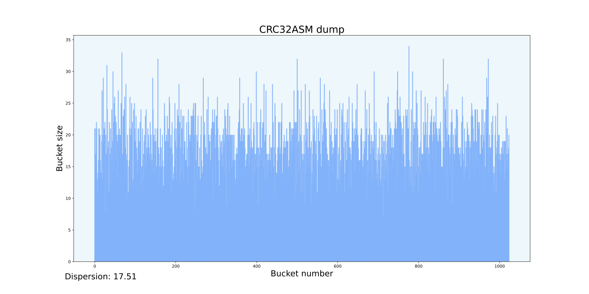
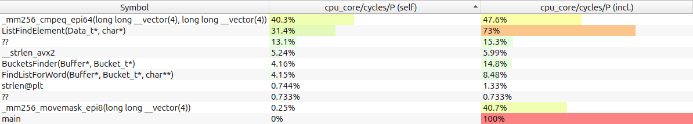

# Hash Table

---

## Оглавление

- [Введение](#введение)
- [Цель и задачи](#цель-и-задачи)
- [Выбор хэш-функции](#выбор-хэш-функции)
- [Методика измерений](#методика-измерений)
- [Базовая версия](#базовая-версия)
- [Версия с оптимизациями компилятора](#версия-с-оптимизациями-компилятора)
- [Оптимизация strcmp](#оптимизация-strcmp)
- [Оптимизация crc32Hash](#оптимизация-crc32hash)
- [Оптимизация FindListForWord](#оптимизация-findlistforword)
- [Вывод](#вывод)

---

## Введение

Хэш-таблица (**_Hash Table_**) — это структура данных, позволяющая хранить элементы в представлении ключ-значения. Хэш-таблица использует хэш-функцию для вычисления числа (**_хэш_**/**_hash_**) по ключу, которое указывает в какой слот (**_bucket_**) попадет ключ со своими значениями.

Бывают случаи, когда хэш-функция выдает один и тот же хэш для разных ключей - это называется **_коллизией_**. В результате коллизии в одном слоте (bucket-е) находится множество различных элементов, что затрудняет поиск правильного значения по ключу. Как можно разрешить проблему коллизии?

1. **Метод списков** (цепочек) - используется в работе

Каждый слот массива - указатель на связный список пар ключ-значения, для которых хеш-функция выдала один результат. Коллизии приводят к тому, что появляются списки длиной более одного элемента. Чтобы избежать коллизий в данной работе используется линейный поиск элементов внутри списка (bucket-а).

<figure style="text-align: center;">
    
    <figcaption>Метод списков</figcaption>
</figure>

2. **Открытая адресация**

Элементы хэш-таблицы хранятся в общем массиве. Если происходит коллизия, то ищется свободная ячейка по определенной схеме (**_метод пробирования_**/**_probing_**) в зависимости от реализации: линейное, квадратичное пробирование или двойное хэширование.

<figure style="text-align: center;">
    
    <figcaption>Открытая адресация</figcaption>
</figure>

> [!NOTE]
> Кроме того, существует `Кукушкино хэширование`, использующее дву хэш-функции для нахождения позиции элемента в хэш-таблице.

Одним из ключевых параметров оценки эффективности хэш-таблицы является фактор/коэффициент загрузки (**_load factor_**):

$$Load \space factor = \frac{Количество \space объектов \space в \space таблице \space (N)}{Размер \space таблицы \space (n)}$$

> [!NOTE]
> Для получения корректного результата при работе хэш-таблицы со строковыми данными следует помнить, что N - количество **уникальных** входных слов, n - общий размер массива (в случае метода списков - количество самих списков, bucket-ов)

> [!IMPORTANT]
> На практике для достижения наибольшей производительности и минимизации коллизий в хэш-таблице оптимальным диапазоном значений для фактора загрузки является:
>
> 1. Для открытой адресации: `Load factor < 1` (_"В любой момент размер таблицы должен быть больше или равен общему количеству ключей"_ - [Geeksforgeeks.org](https://www.geeksforgeeks.org/open-addressing-collision-handling-technique-in-hashing/)).
> 2. Для метода списков: `1 < Load factor < 3` (источник - [Wikipedia/HashTable](https://en.wikipedia.org/wiki/Hash_table))

> [!WARNING]
> В учебных целях фактор загрузки в данной работе был **увеличен** специально для получения частых ситуаций коллизий, которые замедляют поиск. Это позволило лучше отслеживать скорость выполнения алгоритма поиска элементов в хэш-таблице на каждом этапе его оптимизации.

В качестве входных данных для хэш-таблицы было выбрано произведение _J.R.R Tolkien "The Lord of the Ring 1 - The Fellowship of the Ring"_ в оригинале. После обработки во входном файле оказалось `531307` слов, из которых `19030` являются уникальными. Изначальный размер хэш-таблицы - `1024`, обоснование подобного выбора размера будет приведено _далее_ в работе. $Load \space factor \approx 19$.

<p align="right"><a href=#оглавление>(к оглавлению)</a></p>

---

## Цель и задачи

**_Цель_** - провести оптимизацию алгоритма поиска элементов в собственной реализации хэш-таблицы с использованием различных ассемблерных оптимизаций и инструментов для оценки производительности программы.

**_Задачи_**:

1. Выбрать хэш-функцию для таблицы
2. Написать реализацию хэш-таблицы
3. Выбрать инструмент оценки производительности программы
4. Провести оптимизации наиболее _горячих_ функций поиска
5. Проанализировать результаты оптимизаций

<p align="right"><a href=#оглавление>(к оглавлению)</a></p>

---

## Выбор хэш-функции

Проведем анализ некоторых хэш-функций с помощью скрипта, написанного на языке _python_, позволяющего наглядно увидеть распределение данных для определенной хэш-функции на _гистограмме_ и рассчитывающий _дисперсию_ значений заполненности bucket-ов в таблице. Наилучшей функцией будем считать ту, распределение данных по которой наиболее случайно на гистограмме и дисперсия минимальна.

<figure style="text-align: center;">
    
</figure>

<details style="text-align: center;">
    <summary>hash_t StrlenHash</summary>

    hash_t StrlenHash(const void* bytes, const size_t size_in_bytes) {
        return (hash_t)size_in_bytes;
    }

</details>

<figure style="text-align: center;">
    
</figure>

<details style="text-align: center;">
    <summary>hash_t ASCIIsumHash</summary>

    hash_t ASCIIsumHash(const void* bytes, const size_t size_in_bytes) {

        hash_t hash = 0;
        const u_char* byte = (const u_char*)bytes;

        for (size_t i = 0; i < size_in_bytes; i++)
            hash += *byte++;

        return hash;
    }

</details>

<figure style="text-align: center;">
    
</figure>

<details style="text-align: center;">
    <summary>hash_t MurMur1Hash</summary>

    hash_t MurMur1Hash(const void* bytes, const size_t size_in_bytes) {

        hash_t hash = MURMUR1_SEED ^ ((hash_t)size_in_bytes * MURMUR1_CONST);
        const u_char* data = (const u_char*)bytes;

        size_t size = size_in_bytes;
        while (size >= 4) {
            u_int32_t k = *(u_int32_t*)data;

            k *= MURMUR1_CONST;
            k ^= k >> MURMUR1_ROTATION;
            k *= MURMUR1_CONST;

            hash *= MURMUR1_CONST;
            hash ^= k;

            data += 4;
            size -= 4;
        }

        switch(size) {
            case 3: hash ^= (hash_t)(data[2] << 16);
            case 2: hash ^= (hash_t)(data[1] << 8);
            case 1: hash ^= (hash_t)(data[0]);
                    hash *= MURMUR1_CONST;
            default: break;
        };

        hash ^= hash >> 13;
        hash *= MURMUR1_CONST;
        hash ^= hash >> 15;

        return hash;
    }

</details>

<figure style="text-align: center;">
    
</figure>

<details style="text-align: center;">
    <summary>hash_t crc32Hash</summary>

    hash_t crc32Hash(const void* bytes, const size_t size_in_bytes) {

        hash_t crc = CRC32_INIT_CRC;
        const u_char* u_byte = (const u_char*)bytes;
        extern hash_t crc32_table[CRC32_TABLE_SIZE];

        for (size_t i = 0; i < size_in_bytes; i++)
            crc = (crc >> 8) ^ crc32_table[(crc ^ *(const hash_t*)(u_byte++)) & 0xFF];

        return crc ^ 0xFFFFFFFF;
    }

</details>

|     №      | StrlenHash | ASCIIsumHash | MURMUR1Hash | CRC32Hash |
| :--------: | :--------: | :----------: | :---------: | :-------: |
| Dispersion |  38896,26  |    196,65    |    20,01    |   19,78   |

Можно сделать вывод, что среди рассмотренных хэш-функций наиболее случайное распределение имеют `MurMur1 hash` и `CRC32 hash`, но последняя все же имеет наименьшую дисперсию. Именно **_CRC32 hash_** выбрана для хэш-таблицы.

<p align="right"><a href=#оглавление>(к оглавлению)</a></p>

---

## Методика измерений

1.  **Характеристики аппаратуры**

    - Операционная система: Linux 6.11.0-21-generic (x86_64)
    - Процессор: 12th Gen Intel(R) Core(TM) i5-12600KF; 10 cores; 16 treads
    - Компилятор: GCC (Ubuntu 13.3.0-6ubuntu2~24.04) 13.3.0
    - Оперативная память: Intel Corporation Alder Lake-S PCH Shared SRAM (rev 11) 16 GiB
    - Кэш память: L2 - 9.5 MiB, L3 - 20MiB

Программа для анализа характеристик аппаратуры: `System Profiler and Benchmark`

2.  **Инструменты оценки производительности**

**_Perf_** — инструмент для анализа производительности в Linux, встроенный в ядро. Он позволяет собирать данные о циклах процессора, промахах кэша (**_cache-misses_**), системных вызовах, промахах ветвлений (**_branch-misses_**), сменах контекста (**_context switches_**) и об _"узких местах"_ в программе. Основан на **_PMU (Performance Monitoring Unit)_** процессора. Источник - [Brendan Greg](https://www.brendangregg.com/perf.html). Графическую информацию можно получить с помощью **_flame graphs_** или графической оболочки **Hotspot**.

```
perf record -F 99 -g ./build/Release/HashTable --crc32
hotspot perf.data
```

**_Valgrind_** — набор инструментов для отладки, анализа утечек памяти, поиска ошибок управления памятью и профилирования программ, работающих под Linux. Включает в себя различные модули, например **_Cachegrind_** - анализ использования кэша процессора (L1/L2) и **_Callgrind_** - профилирование вызовов функций. Для визуализации используется графическая оболочка **_kcachegrind_**. (ссылка на документацию - [Vallgrind.org](https://valgrind.org/))

```
valgrind --tool=callgrind ./build/Release/HashTable --crc32
kcachegrind callgrind.out.base
```

> [!TIP]
> Для проверки корректности работы соответствующих оптимизаций будем сравнивать результаты обоих инструментов между собой и с предыдущими версиями без оптимизаций.

> [!NOTE]
> Поиск будет производиться по элементам из того же файла, откуда элементы загрузились в хэш-таблицу и количество таких файлов поиска составляет константа `FINDER_ITERATIONS` = 700, то есть всего будет произведено `371914900` операций поиска слов.

> [!IMPORTANT]
> Измерения времени будем проводить только для функции поиска элементов по хэш-таблице, убедившись, что поиск занимает большую часть времени выполнения программы по сравнению с загрузкой элементов в таблицу. Кроме того, не забудем внести под условную компиляцию проверки и верификаторы списков.

<p align="right"><a href=#оглавление>(к оглавлению)</a></p>

---

## Базовая версия

**Без оптимизации (без флагов):**
| № | 1 | 2 | 3 | 4 | 5 | 6 | 7 | 8 | 9 | 10 |
| :--: | :---: | :---: | :---: | :---: | :---: | :---: | :---: | :---: | :---: | :---: |
| t, c | 21,24 | 21,15 | 21,24 | 21,15 | 21,11 | 21,09 | 21,34 | 21,17 | 21,22 | 21,31 |

**Статистика**

- Среднее время: `21,20 ± 0,06` с (`0,1` %)

<figure style="text-align: center;">
    
    <figcaption>Perf base version (-O0)</figcaption>
</figure>

<figure style="text-align: center;">
    
    <figcaption>Callgrind base version (-O0)</figcaption>
</figure>

> [!NOTE]
> Можем увидеть, что инструменты выдали разный результат по собственному времени выполнения функций. Из подобного анализа мы можем убедиться по функции `crc32Hash` в `Callgrind` в том, что поиск элементов в таблице много превышает загрузку: `372446207` = `700` \* `531307` (Поиск) + `531307` (Загрузка).

Функцию для оптимизации выберем по результатам инструментов из оптимизаций компилятора.

<p align="right"><a href=#оглавление>(к оглавлению)</a></p>

---

## Версия с оптимизациями компилятора

**С оптимизацией (-O3):**
| № | 1 | 2 | 3 | 4 | 5 | 6 | 7 | 8 | 9 | 10 |
| :--: | :---: | :---: | :---: | :---: | :---: | :---: | :---: | :---: | :---: | :---: |
| t, c | 16,92 | 16,59 | 16,47 | 16,70 | 16,72 | 16,78 | 16,60 | 16,67 | 16,65 | 16,86 |

**Статистика**

- Среднее время: `16,70 ± 0,05` с (`0,3` %)

<figure style="text-align: center;">
    
    <figcaption>Perf O3 version</figcaption>
</figure>

<figure style="text-align: center;">
    
    <figcaption>Callgrind O3 version</figcaption>
</figure>

> [!NOTE]
> Видим, что наибольшей по времени выполнения является функция `__strcmp_avx2`, следовательно оптимизировать первой будем именно её.

> [!WARNING]
> По результатам профилировщиков на данный момент нельзя выбрать один из них.

$$
Коэффициент \space ускорения = \frac{21,20}{16,70} = 1,27
$$

<p align="right"><a href=#оглавление>(к оглавлению)</a></p>

---

## Оптимизация strcmp

Ускорять функцию сравнения строк будем при помощи одной ассемблерных оптимизаций, а именно **_intrinsic functions_**. Для этого потребуется изменить формат входных данных: каждое слово будет выравнено по 32 байта, если же слово выходит за рамки 32 байт, оно будет пропущено, то есть не попадет в файл, а значит и в таблицу. Формат входного слова: `word` + `\0` \* (32 - strlen(word) - 1) + `\n`. Для работы с бинарным форматом изменим расширение файла на `.bin`.

<details id="list-find-element">
    <summary>Функция ListFindElement с измененным сравнением:</summary>

    Data_t* ListFindElement(Data_t* data, char* word) {

        if (!data)
            return NULL;

    #ifdef BASE
        if (!strcmp(data->data->word, word))
            return data;
    #else
        if (_mm256_movemask_epi8(_mm256_cmpeq_epi64(*(__m256i*)data->data->word, *(__m256i*)word)) == -1)
            return data;
    #endif

        return ListFindElement(data->next, word);
    }

</details>

> [!NOTE]
> Под условной компиляцией оставим возможность вернуться к исходной программе.

**strcmp на intrinsic functions:**
| № | 1 | 2 | 3 | 4 | 5 | 6 | 7 | 8 | 9 | 10 |
| :--: | :---: | :---: | :---: | :---: | :---: | :---: | :---: | :---: | :---: | :---: |
| t, c | 13,60 | 13,73 | 13,60 | 13,72 | 13,70 | 13,76 | 13,76 | 13,61 | 13,64 | 13,60 |

**Статистика**

- Среднее время: `13,670 ± 0,013` с (`0,1` %)

<figure style="text-align: center;">
    
    <figcaption>Perf strcmp intrinsic version</figcaption>
</figure>

<figure style="text-align: center;">
    
    <figcaption>Callgrind strcmp intrinsic version</figcaption>
</figure>

> [!NOTE]
> Можем заметить, что из callgrind пропала информация про функцию `__strcmp_avx2`, которая была заменена на соответствующие интринсики, отсюда сделаем вывод, что в дальнейшем не будем прибегать к результатам данного профилировщика, так как он не отображает время, затраченное на работу intrinsic функций.

> [!NOTE]
> По результатам perf на первом месте появился интринсик, заменивший собой `__strcmp_avx2`. Данное 'узкое место' программы уже подверглась оптимизации, поэтому для дальнейших оптимизаций нужно выбрать следующую функцию.

> [!WARNING]
> Заметим, что следующая функция <a href="#list-find-element">`ListFindElement`</a> содержит оптимизации предыдущего этапа и рекурсивный вызов сомой себя. Если применить оптимизацию ассемблерной вставкой или переписать всю функцию на языке ассемблера, то пропадет смысл оптимизаций на шаге ранее. Поэтому в качестве следующей функции для оптимизации выберем `crc32Hash`.

$$
Коэффициент \space ускорения = \frac{16,70}{13,67} = 1,22
$$

<p align="right"><a href=#оглавление>(к оглавлению)</a></p>

---

## Оптимизация crc32Hash

1. Оптимизацию функцию хэширования произведем путем написания самой функции на языке ассемблера.

<details>
    <summary>crc32Hash на ассемблере:</summary>

    global crc32Asm
    section .text

    ;==============================================================================
    ;	Give string hash
    ;	Entry:		RDI - address of bytes string
    ;				RSI - size of string in bytes
    ;	Exit:		AX - string hash
    ;	Destroy:	RSI, RDI, RAX
    ;==============================================================================
    crc32Asm:
        add rsi, rdi
        mov rax, 0xFFFFFFFF
        crc_loop:
            add rdi, 0x1
            crc32 rax, byte [rdi - 0x1]
            cmp rdi, rsi
        jne crc_loop
        not rax
        ret
    ;==============================================================================

</details>

> [!TIP]
> Убеждаемся в случайности распределения функции:

<figure style="text-align: center;">
    
</figure>

|  №   |   1   |   2   |   3   |   4   |   5   |   6   |   7   |   8   |   9   |  10   |
| :--: | :---: | :---: | :---: | :---: | :---: | :---: | :---: | :---: | :---: | :---: |
| t, c | 13,27 | 13,33 | 13,35 | 13,30 | 13,34 | 13,39 | 13,30 | 13,33 | 13,21 | 13,43 |

**Статистика**

- Среднее время: `13,33 ± 0,011` с (`0,1` %)

<figure style="text-align: center;">
    
    <figcaption>Perf crc32Hash assembler version</figcaption>
</figure>

> [!NOTE]
> Из результатов профилировщика замечаем, что `??` отражает нашу функцию, но кардинальных изменений собственных времен функций не наблюдаем, в прочем как и сильного ускорения программы, однако

$$
Коэффициент \space ускорения = \frac{13,67}{13,33} \approx 1,03
$$

2. Также рассмотрим оптимизацию с помощью интринсиков.

<details>
    <summary>crc32Hash на интринсиках:</summary>

    hash_t crc32IntrinsicHash(const void* bytes, const size_t size_in_bytes) {

        hash_t crc = CRC32_INIT_CRC;
        const u_char* byte = (const u_char*)bytes;

        for (size_t i = 0; i < size_in_bytes; i++)
            crc = _mm_crc32_u8(crc, *byte++);

        return crc ^ 0xFFFFFFFF;
    }

</details>

> [!TIP]
> Убеждаемся в случайности распределения функции:

<figure style="text-align: center;">
    
</figure>

|  №   |   1   |   2   |   3   |   4   |   5   |   6   |   7   |   8   |   9   |  10   |
| :--: | :---: | :---: | :---: | :---: | :---: | :---: | :---: | :---: | :---: | :---: |
| t, c | 13,65 | 13,42 | 13,50 | 13,60 | 13,43 | 13,42 | 13,51 | 13,38 | 13,48 | 13,43 |

**Статистика**

- Среднее время: `13,48 ± 0,02` с (`0,2` %)

<figure style="text-align: center;">
    
    <figcaption>Perf crc32Hash intrinsic version</figcaption>
</figure>

> [!NOTE]
> Видно, что наша хэш-функция стала значительно меньше выполняться по времени. Также можем сделать выбор для функции подходящей для следующей оптимизации - `FindListForWord`. Однако, коэффициент ускорения стал ниже:

$$
Коэффициент \space ускорения = \frac{13,67}{13,48} \approx 1,01
$$

<p align="right"><a href=#оглавление>(к оглавлению)</a></p>

---

## Оптимизация FindListForWord

Оптимизировать данную функцию будем методом встроенного ассемблера (**_inline assembler_**). Приведем обоснование необходимости выбора размера хэш-таблицы, оговоренного ранее - `1024`. В данной функции используется операция взятия остатка от деления, которая имеет большое время выполнения. Вследствие этого, если число, на которое мы делим, является степенью двойки, то можно заменить операцию взятия остатка от деления на битовое маскирование значение хэша с этой самой степенью двойки без единицы.

<details>
    <summary>Как выглядит функция после оптимизации:</summary>

    List_t* FindListForWord(Buffer* buffer, Bucket_t* buckets, char** word) {
    	List_t* list = 0;
    	asm volatile (
    		 "mov 0x8(%[buffer]), %%r12\n"              //r12 = buffer->data
    		 "add 0x18(%[buffer]), %%r12\n"		    //r12 += buffer->shift
    		 "mov %%r12, (%[word])\n"                   //*word = r12;

    		 "mov %%r12, %%rdi\n"
    		 "call strlen\n"			    //length = strlen(*word)

    		 "mov %[buckets], %%rbx\n"		    //rbx = buckets
    		 "mov %%rax, %%rsi\n"			    //rsi = length
    		 "mov 0x10(%%rbx), %%rax\n"		    //rax = buckets->hash_function
    		 "call *%%rax\n"
    		 "mov %%rax, %%r8\n"			    //hash = buckets->hash_function(*word, length)

    		 "mov $0x20, %%rcx\n"			    //rcx = ALIGNMENT_COUNT
    		 "add %%rcx, 0x18(%[buffer])\n"		    //buffer->shift += rcx

    		 "and $0x3ff, %%r8\n"			    //hash &= 1024 - 1 | hash %= buckets->size
    		 "mov 0x8(%%rbx), %%rax\n"		    //rax = buckets->lists
    		 "lea (%%r8, %%r8, 2), %%r8\n"	            //r8 = 3 * r8
    		 "lea (%%rax, %%r8, 8), %%rax\n"	    //rax = rax + 8 * r8 | buckets->lists + (hash % buckets->size)
    		 "mov %%rax, %[list]\n"			    //list = rax

    		 : [list] 	"=r" (list),		    //output parameter
    		   "+o" (word)				    //input and output parameter
    		 : [buffer] 	"r" (buffer),		    //input parameters
    		   [buckets] 	"r" (buckets),
    		   [word] 	"r" (word)
    		 : "%r12", "%rbx", "%rsi", "%rdi", "%r8",   //changed registers
    		   "%rax", "%rcx", "%r11", "memory"
    	);
    	return list;
    }

</details>

|  №   |   1   |   2   |   3   |   4   |   5   |   6   |   7   |   8   |   9   |  10   |
| :--: | :---: | :---: | :---: | :---: | :---: | :---: | :---: | :---: | :---: | :---: |
| t, c | 12,27 | 12,14 | 12,21 | 12,09 | 12,18 | 12,10 | 12,21 | 12,20 | 12,15 | 12,17 |

**Статистика**

- Среднее время: `12,17 ± 0,01` с (`0,1` %)

<figure style="text-align: center;">
    
    <figcaption>Perf FindListForWord</figcaption>
</figure>

> [!NOTE]
> Прирост ускорения выполнения программы на данном этапе оптимизации оказался больше, нежели раньше.

$$
Коэффициент \space ускорения = \frac{13,33}{12,17} \approx 1,09
$$

<p align="right"><a href=#оглавление>(к оглавлению)</a></p>

---

## Вывод

В рамках реальных промышленных задач прирост производительности в 9% является огромным, однако в рамках учебной задачи остановимся в оптимизации на данном этапе. Основные функции, связанные с алгоритмом поиска были улучшены в производительности. Общее ускорение составило:

$$
Коэффициент \space ускорения = \frac{21,20}{12,17} \approx 1,7
$$

> [!NOTE]
> Количество ассемблерных строк, потребовавшихся для оптимизации и ухудшившие читаемость программы - `31`

$$
Тотальный \space коэффициент \space ускорения = \frac{1,7}{31} \cdot 1000 \approx 55
$$

<p align="right"><a href=#оглавление>(к оглавлению)</a></p>
